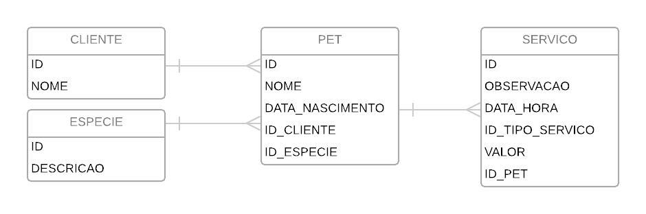

## 4ª edição Curso de Férias 2019 - Construindo APIs REST com Spring

```

```

* ## Estrutura das aulas

  * **Aula 1**
      * [Slides - aula 1](https://docs.google.com/presentation/d/1DpL6uBw-hp5ox8unehsFdmAvYbtkWVhVYlh0zb3bSNY/edit?usp=sharing)
  * **Aula 2**
      * [Slides - aula 2](https://docs.google.com/presentation/d/14D4vZ0f43wYUHp5pKhfuydlKwps1Mpc02Wn5BqxmnSc/edit#slide=id.g3ea92d5bb8_1_0)
      * Criação do projeto inicial com [Spring Initializr](https://start.spring.io/)
      * Entendendo o contexto do Spring
        * Inversão de controle
        * Injeção de dependências
      * Criação de beans no contexto do Spring e possíveis problemas
        * Uso da interface **CommandLineRunner**
        * Uso de *annotations* **@Component**, **@Autowired**, **@Primary** e **@Qualifier**
      * Uso de Spring Profiles
      * [Branch - aula 2](https://github.com/materasystems/curso-de-ferias-2019-spring/tree/aula_2)
  * **Aula 3**
      * JPA
      * Spring Data
      * H2 console
      * Criação da estrutura do pacote **entity** com as entidades do banco de dados
      * Conexão estabelecida com banco de dados
      * Criação da estrutura do pacote **repository**
      * [Branch - aula 3](https://github.com/materasystems/curso-de-ferias-2019-spring/tree/aula_3)
  * **Aula 4**
      * Refatorando entidades com a criação da classe **EntidadeBase**
      * Alterações no enum **TipoServico** e seu respectivo mapeamento na classe **Servico** para não gravar o ordinal do enum
      * Criação da estrutura do pacote **business** usando conceitos de Java Generics
      * Usando a classe **DataInitializer** para alimentar a base de dados do H2 utilizando as classes do pacote **business**
      * [Branch - aula 4](https://github.com/materasystems/curso-de-ferias-2019-spring/tree/aula_4)
  * **Aula 5**
      * Criação da estrutura do pacote **dto** com classes de *Response*
      * Criação da estrutura do pacote **service** usando conceitos de Java Generics
      * Criação da estrutura do pacote **controller** com requisições *GET*
      * Anotações do Jackson para formatação do JSON
      * Requisições via Postman
      * [Branch - aula 5](https://github.com/materasystems/curso-de-ferias-2019-spring/tree/aula_5)
  * **Aula 6**
      * Criação das classes de *Request* no pacote **dto**
      * Criação das requisições *POST*, *PUT* e *DELETE*
      * Criação de requisições *GET* mais complexas
      * [Branch - aula 6](https://github.com/materasystems/curso-de-ferias-2019-spring/tree/aula_6)
  * **Aula 7**
      * Tratamento de códigos de retorno HTTP
      * *Exception handler*
      * Criação de validações na camada **business**
      * Validações nos *requests*
      * [Branch - aula 7](https://github.com/materasystems/curso-de-ferias-2019-spring/tree/aula_7)
  * **Aula 8**
      * Testes unitários da camada **controller** com *mock*
      * Testes integrados com banco de dados H2 (bônus)
      * [Branch - aula 8](https://github.com/materasystems/curso-de-ferias-2019-spring/tree/aula_8)
  * **Aula 9**
      * Revisão
      * Criação da estrutura da API de veterinário
        * *Entity*
        * *Repository*
        * *Business*
        * *Service* e *DTOs*
        * *Controller*
        * *Unit tests*
      * [Branch - aula 9](https://github.com/materasystems/curso-de-ferias-2019-spring/tree/aula_9)
  * **Aula 10**
      * Finalização da estrutura da API de veterinário
      * Vincular entidade de veterinário à entidade de serviço
      * Dúvidas
      * [Branch - aula 10](https://github.com/materasystems/curso-de-ferias-2019-spring/tree/aula_10)

* ## Projeto
  * ### Especificações técnicas
    * **Linguagem de programação:** Java - jdk1.8.0_152 ou superior
    * **Gerenciador de dependências:** apache-maven-3.0.4
    * **Spring Boot:** 2.1.2
    * **Banco de dados:** H2 database - http://localhost:8080/h2
    * **Testes unitários:** Mockito + JUnit
    * **Swagger**: [petstore.yaml](etc/petstore.yaml)
    * **Postman**: [PetStore.postman_collection.json](etc/PetStore.postman_collection.json)

  * ### Modelagem
    

  * ### Representações

      Os modelos de entrada e saída são representados no formato JSON

      * **Cliente**

        *ClienteRequestDTO*
        ```json
        {
          "nome": "Pedro"
        }
        ```

        *ClienteResponseDTO*
        ```json
        {
          "id": 1,
          "nome": "Pedro"
        }
        ```
      * **Espécie**

        *EspecieRequestDTO*
        ```json
        {
          "descricao": "Cachorro"
        }
        ```

        *EspecieResponseDTO*
        ```json
        {
          "id": 1,
          "descricao": "Cachorro"
        }
        ```
      * **Pet**

        *PetRequestDTO*
        ```json
        {
          "nome": "Rex",
          "dataNascimento": "01/01/2019",
          "idCliente": 1,
          "idEspecie": 1
        }
        ```

        *PetResponseDTO*
        ```json
        {
          "id": 1,
          "nome": "Rex",
          "dataNascimento": "01/01/2019",
          "cliente": {
            "id": 1,
            "nome": "Pedro"
          },
          "especie": {
            "id": 1,
            "descricao": "Cachorro"
          }
        }
        ```
      * **Serviço**

        *ServicoRequestDTO*
        ```json
        {
          "observacao": "Consulta",
          "idTipoServico": 1,
          "valor": 80.00,
          "idPet": 1
        }
        ```

        *ServicoResponseDTO*
        ```json
        {
          "id": 1,
          "observacao": "Consulta",
          "dataHora": "11/01/2019 12:38:17",
          "tipoServico": "Consulta",
          "valor": 80.00,
          "pet": {
            "id": 1,
            "nome": "Rex",
            "dataNascimento": "01/01/2019",
            "cliente": {
              "id": 1,
              "nome": "Pedro"
            },
            "especie": {
              "id": 1,
              "descricao": "Cachorro"
            }
          }
        }
        ```

  * ### Requisições

      * **Cliente**

      Método | URL                                             | Entrada             | Saída
      ------ | ----------------------------------------------- | ------------------- | ------ |
      POST   | http://localhost:8080/api/v1/clientes           | *ClienteRequestDTO* | 201 (Created)
      GET    | http://localhost:8080/api/v1/clientes           |                     | 200 (OK) Lista *ClienteResponseDTO*
      GET    | http://localhost:8080/api/v1/clientes/{id}      |                     | 200 (OK) *ClienteResponseDTO*
      GET    | http://localhost:8080/api/v1/clientes/{id}/pets |                     | 200 (OK) Lista *PetResponseDTO*
      PUT    | http://localhost:8080/api/v1/clientes/{id}      | *ClienteRequestDTO* | 204 (No Content)
      DELETE | http://localhost:8080/api/v1/clientes/{id}      |                     | 204 (No Content)

      * **Espécie**

      Método | URL                                             | Entrada             | Saída
      ------ | ----------------------------------------------- | ------------------- | ------ |
      POST   | http://localhost:8080/api/v1/especies           | *EspecieRequestDTO* | 201 (Created)
      GET    | http://localhost:8080/api/v1/especies           |                     | 200 (OK) Lista *EspecieResponseDTO*
      GET    | http://localhost:8080/api/v1/especies/{id}      |                     | 200 (OK) *EspecieResponseDTO*
      GET    | http://localhost:8080/api/v1/especies/{id}/pets |                     | 200 (OK) Lista *PetResponseDTO*
      PUT    | http://localhost:8080/api/v1/especies/{id}      | *EspecieRequestDTO* | 204 (No Content)
      DELETE | http://localhost:8080/api/v1/especies/{id}      |                     | 204 (No Content)

      * **Pet**

      Método | URL                                             | Entrada          | Saída
      ------ | ----------------------------------------------- | ---------------- | ------ |
      POST   | http://localhost:8080/api/v1/pets               | *PetRequestDTO*  | 201 (Created)
      GET    | http://localhost:8080/api/v1/pets               |                  | 200 (OK) Lista *PetResponseDTO*
      GET    | http://localhost:8080/api/v1/pets/{id}          |                  | 200 (OK) *PetResponseDTO*
      GET    | http://localhost:8080/api/v1/pets/{id}/servicos |                  | 200 (OK) Lista *ServicoResponseDTO*
      PUT    | http://localhost:8080/api/v1/pets/{id}          | *PetRequestDTO*  | 204 (No Content)
      DELETE | http://localhost:8080/api/v1/pets/{id}          |                  | 204 (No Content)

      * **Serviço**

      Método | URL                                             | Entrada             | Saída
      ------ | ----------------------------------------------- | ------------------- | ------ |
      POST   | http://localhost:8080/api/v1/servicos      	   | *ServicoRequestDTO* | 201 (Created)
      GET    | http://localhost:8080/api/v1/servicos      	   |                     | 200 (OK) Lista *ServicoResponseDTO*
      GET    | http://localhost:8080/api/v1/servicos/{id} 	   |                     | 200 (OK) *ServicoResponseDTO*
      GET    | http://localhost:8080/api/v1/servicos/buscaPorData?dataInicial=dd/MM/yyyy&dataFinal=dd/MM/yyyy |                     | 200 (OK) Lista *ServicoResponseDTO*
      PUT    | http://localhost:8080/api/v1/servicos/{id} 	   | *ServicoRequestDTO* | 204 (No Content)
      DELETE | http://localhost:8080/api/v1/servicos/{id} 	   |                     | 204 (No Content)
